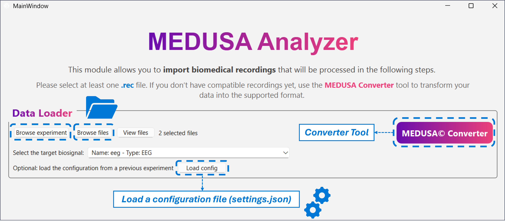
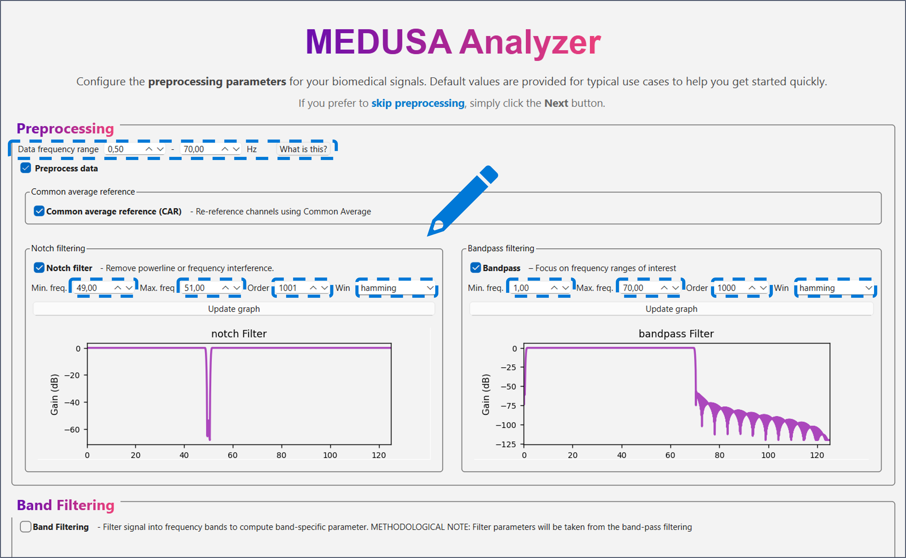
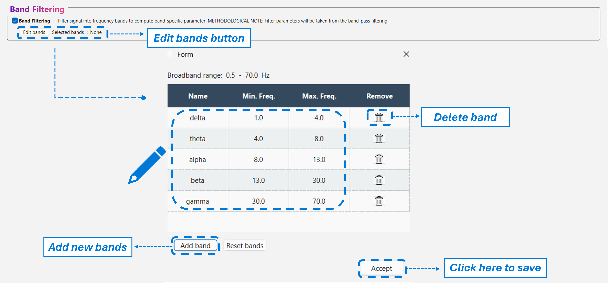
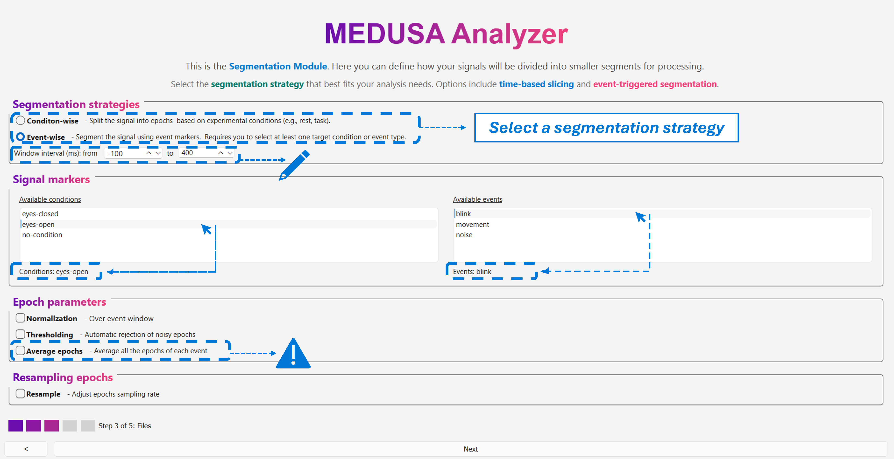
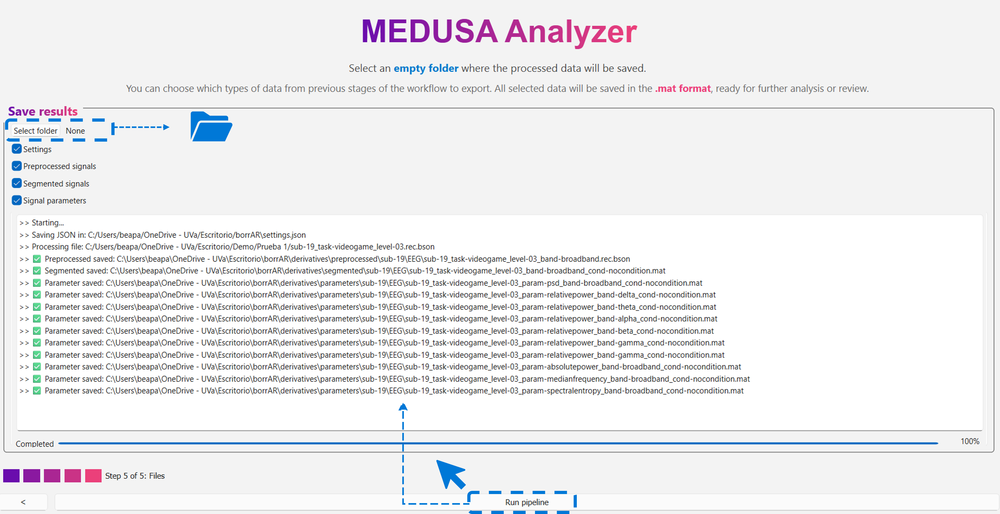

# EEG Feature Extraction

In the **EEG Feature Extraction** experiment, users can **preprocess EEG signals** and **extract a wide variety of features** for further analysis. This experiment is divided into several windows that guide you through the full workflow — from data loading to saving the results.

---

## 1. Loading Data

When clicking on **EEG Feature Extraction** in the main window, the first screen you will see is the **Data Loader**.

Here, you can:
- Load an entire **experiment** (e.g., a folder containing subjects and sessions), or
- Load a **single EEG recording file**.

The supported file format for EEG data is **`.rec.bson`**, which is the **native MEDUSA© format**, also used across the MEDUSA© ecosystem (e.g., *MEDUSA© Platform* and *MEDUSA© Kernel*).

{ width="600px"}
---
### Converter Tool

In the Data Loader window, you will find a **Converter** button.  
This tool allows you to convert different biosignal file types to the `.rec.bson` format.

!!! tip
    It is highly recommended to convert your data first using this Converter before loading it into the Analyzer.  
    The Converter also organizes converted data into the **BIDS** structure — the format that MEDUSA© Analyzer is optimized for.

Once your data are ready:
- Click **Browse file** to load a single `.rec.bson` file, or  
- Click **Browse experiment** to load an entire experiment folder.

After loading, the detected biosignal type will appear under **Selected biosignal** — in this case, EEG.

!!! note
    If you have a saved **configuration file (`settings.json`)** generated by MEDUSA© Analyzer, you can load it here.  
    This will automatically apply all the preprocessing, segmentation, and feature extraction parameters from a previous session.

---

## 2. Preprocessing

After loading the data, click **Next** to enter the **Preprocessing** window.  
Here you can apply various filters and transformations to your EEG signals.

At the top of the window, you will see a summary of the current frequency range of your data.
When you apply filtering (for example, a band-pass filter), this information updates automatically to reflect 
the new passband of the processed signal.

Available preprocessing options include:
- **Common Average Reference (CAR)**
- **Notch filter**
- **Band-pass filter**

Each filter has customizable parameters such as **filter order**, **window size**, and **frequency limits**.
To update filter plots after modifying parameters, click on '**Update graph**'.

{ width="600px"}
---

### Band Filtering

At the bottom of this window, you can enable **band filtering** to split your signal into specific frequency bands.

By default, the EEG bands are:
| **Band** | **Frequency Range (Hz)** |
|----------|---------------------------|
| Delta | 0.5–4 |
| Theta | 4–8 |
| Alpha | 8–13 |
| Beta | 13–30 |
| Gamma | 30–70 |

Click **Edit Bands** to open the editable band table.

You can:
- Rename or modify frequency limits directly in the table.  
- Remove bands that you do **not** wish to include.
- Add new bands by clicking **Add Band**.

{ width="600px"}

!!! warning
    Band names **must not contain spaces**.  
    For example, use `beta1` and `beta2` instead of `beta 1` and `beta 2`.

!!! note
    When band filtering is enabled, **all features** will be computed both for the **broadband signal** and for each selected frequency band.

---

## 3. Segmentation

Click **Next** to proceed to the **Segmentation** window.

You can choose to segment the EEG signal by:
- **Condition**, or  
- **Event**.

Detected conditions (e.g., *eyes open*, *eyes closed*) or events (e.g., *stimulus*, blinks) are automatically listed.  
Select your segmentation mode and specify the **epoch window** (e.g., from -100 ms to 700 ms around an event).

Additional options include:
- **Stride segmentation** – to define overlapping epochs (only for condition-based segmentation strategy.
- - **Normalization** – choose between mean-only or mean+standard deviation normalization.
- **Automatic rejection (thresholding)** – epochs exceeding a given number of standard deviations will be discarded.
- **Average epochs** – averages the resulting parameters across all epochs in the recording.
- **Resampling** – specify a new target sampling rate.

!!! tip
    It is recommended to enable **Average epochs** for better visualization and summary statistics in later analyses.

{ width="600px"}

---

## 📊 4. Feature Extraction

In the **Feature Extraction** window, you can compute a wide range of features grouped into several categories:

- **Time-domain features**  
  Mean, variance, skewness, kurtosis, etc.

- **Spectral features**  
  Power Spectral Density (PSD), absolute and relative power, median frequency, spectral entropy, etc.

- **Non-linear features**  
  - **Central Tendency Measure (CTM)**  
    Quantifies the dispersion of points in phase space.  
    - **Parameter:** `radius` — defines the neighborhood size; smaller radii capture finer signal fluctuations.

  - **Sample Entropy (SampEn)**  
    Measures the unpredictability of the signal.  
    - **m:** embedding dimension or pattern length (commonly 2).  
    - **r:** tolerance threshold, typically a proportion of the signal’s standard deviation.

  - **Multiscale Sample Entropy (MSE)**  
    Extends SampEn across multiple temporal scales to characterize complexity.  
    - **max scale:** maximum number of coarse-grained scales.  
    - **m:** embedding dimension.  
    - **r:** similarity tolerance.  
    At each scale, the signal is coarse-grained before computing entropy.

  - **Lempel–Ziv Complexity (LZC)**  
    Quantifies the complexity of a signal based on the number of new binary patterns encountered while scanning through it.

  - **Multiscale Lempel–Ziv Complexity (MLZC)**  
    Computes LZC across multiple coarse-grained scales.  
    - Scales must be **manually entered** as a list, e.g.:  
      `[1, 3, 5]`  
    - **Important:** scales must be **odd numbers**.

- **Connectivity metrics**  
  - **Amplitude-based metrics**  
    - **IAC (Inter-areal Amplitude Correlation)**  
    - **AEC (Amplitude Envelope Correlation)**  
      Includes an **orthogonalization option** to reduce spurious coupling due to volume conduction.

  - **Phase-based metrics**  
    - **wPLI (Weighted Phase Lag Index)**  
    - **PLI (Phase Lag Index)**  
    - **PLV (Phase Locking Value)**

!!! note  
If you previously enabled **band filtering**, each feature will be computed both for the **broadband signal** and for every **selected frequency band**.  
Simply select the desired metrics using the corresponding checkboxes.

---

## 5. Saving Results

Finally, click **Next** to open the **Save Results** window.

At the top, select an **empty folder** where your results will be stored.

!!! warning
    The output folder **must be empty** before saving results.

You can then choose which stages of the analysis to save:
- **Settings (.json)** – contains all configuration parameters.  
  It is strongly recommended to save this file for reproducibility.  
- **Preprocessed signal**
- **Segmented signal**
- **Extracted features**

{ width="600px"}

### Reusing Configurations
The saved `.json` configuration file can later be **loaded in the Data Loader window**, automatically restoring all parameters used in the original experiment.  
This allows you to share your full pipeline setup with other users to replicate results.

---

## 📁 Output Structure (BIDS Format)

All saved data follow the **semi-BIDS directory structure**, consistent with MEDUSA© Analyzer conventions:

```text
[selected_folder]/
├── settings.json
└── derivatives/
    ├── preprocessed/
    │   └── EEG/
    ├── segmented/
    │   └── EEG/
    └── parameters/
        └── EEG/
