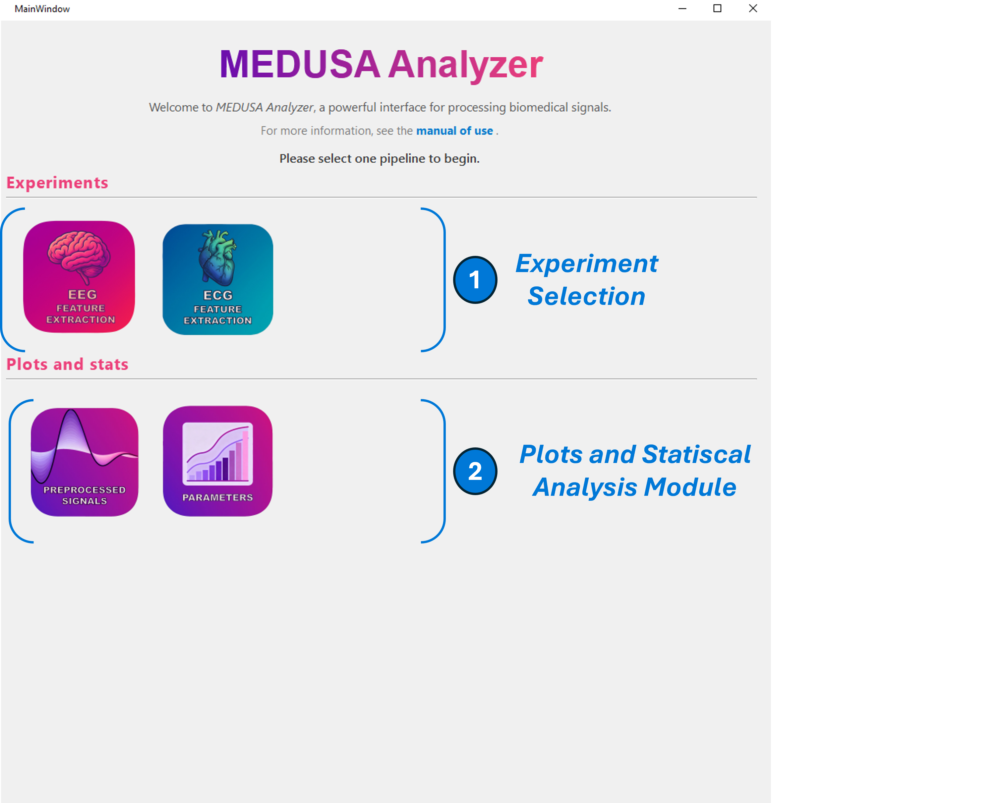

# Main Interface Overview

The **Main Interface** of MEDUSA© Analyzer is divided into two principal sections.

---

## 1️⃣ Experiment Selection
The upper part of the interface lists the available experiments you can run:

- **EEG Feature Extraction**
- **ECG Feature Extraction**

Each button opens a complete workflow for loading, preprocessing, segmenting, and extracting features from the selected biosignal.

---

## 2️⃣ Plots and Statistical Analysis Module
The lower section of the main window gives access to visualization and statistical tools.  
You can use this module to:

- Visualize processed data
- Compare metrics across subjects or conditions
- Generate publication-ready plots

---

{ width="600px"}
---

!!! tip "Tip"
    At this stage of the manual, you only need to know that **every analysis starts by selecting an experiment**.  
    In later chapters, each experiment (EEG and ECG) will be explained in detail.
