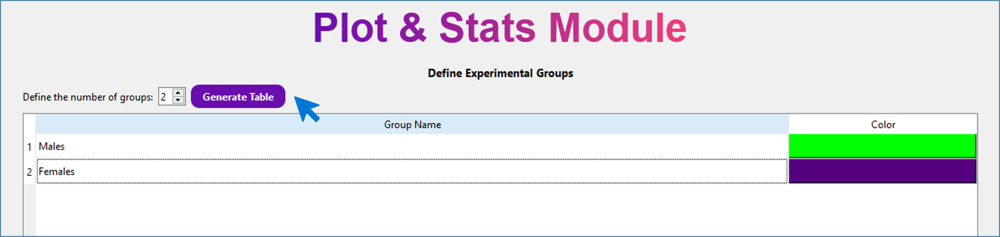
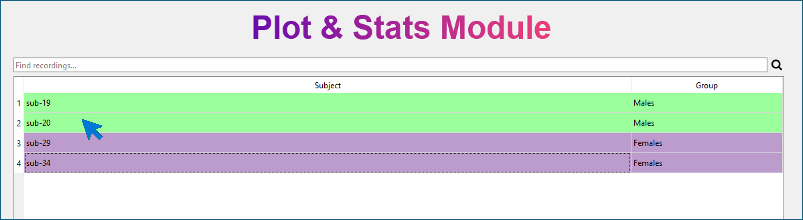
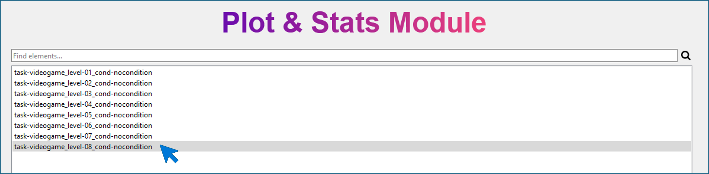
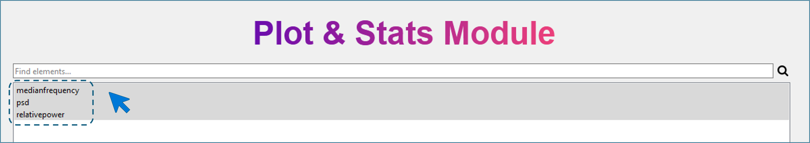
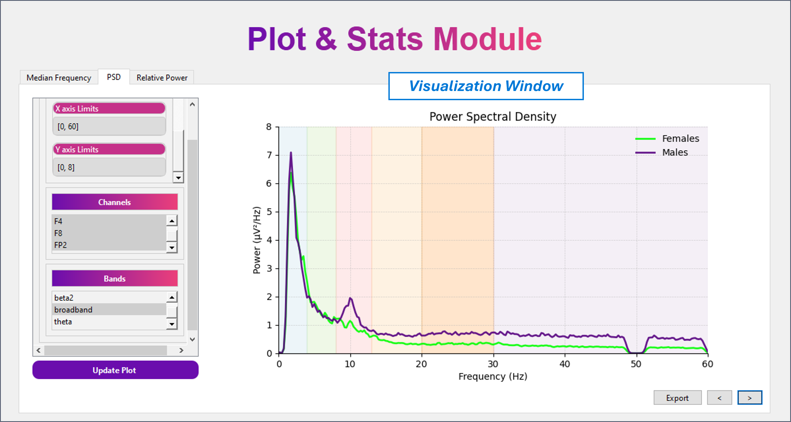
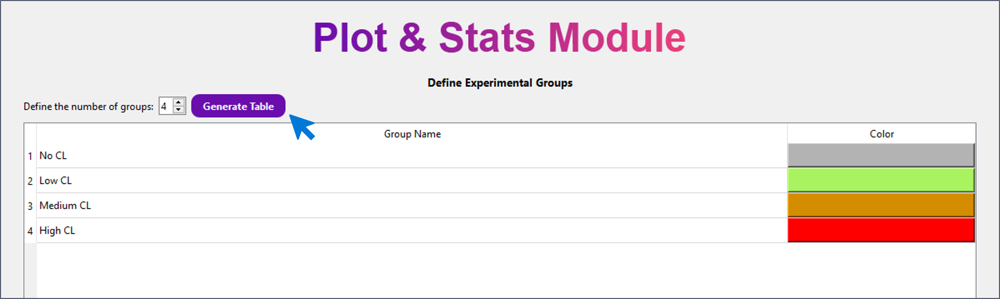
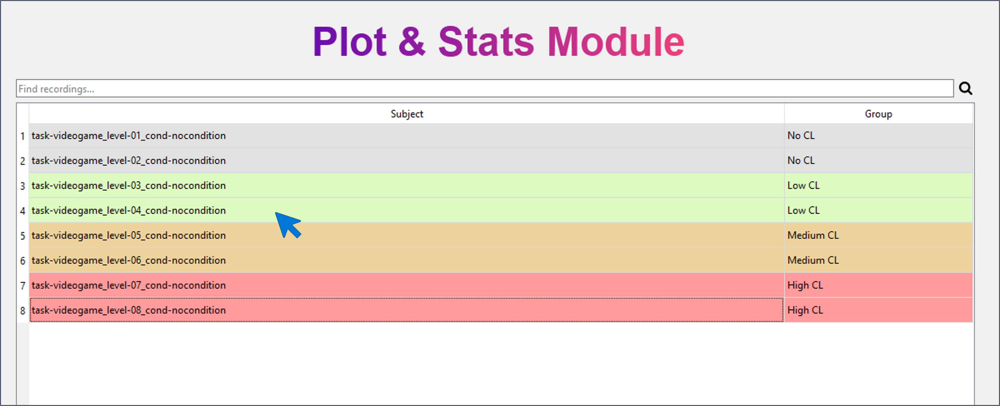
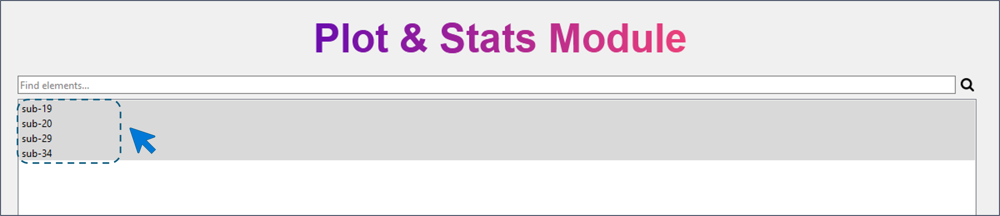
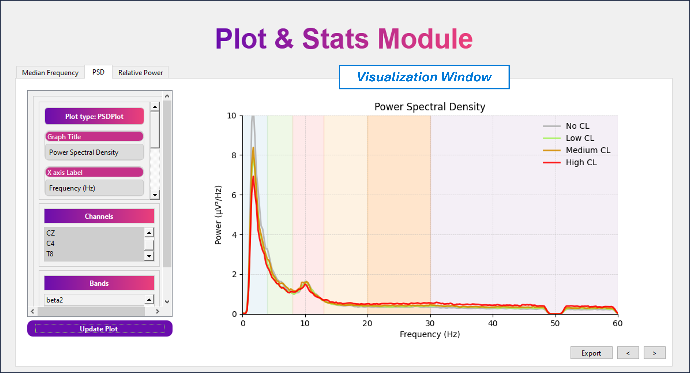

# Plot Parameters 

The Plot Parameters module allows users to visualize and compare the parameters previously computed with MEDUSA© Analyzer.
This module supports two types of analyses:

- Within-subject analysis (paired)
- Between-subject analysis (unpaired)

A **within-subject analysis** compares the same participants across different conditions or sessions, 
whereas a **between-subject** analysis compares different groups of participants (e.g., males vs. females, 
control vs. Alzheimer’s disease, younger vs. older adults).

---

## 1. Loading Processed Data 

The first window of this module asks for the path to the processed experiment directory.

!!! warning
The selected folder must come from MEDUSA© Analyzer, after finishing an experiment and saving results.

Your folder must contain:

```pgsql
data/
├── settings.json
└── derivatives/
    └── parameters/
```
- `setttings.json` = experiment configuration
- `derivatives/parameters/` = all computed parameters files (`.mat`)

After the folfer is loaded, select one of the analysis (within-subject or between-subject) 
and click `Next` button. 

---

## Between-Subject Analysis
This section explains how to configure a between-subjects comparison.
To illustrate the workflow, we will use the example **Males vs. Females**, although you 
may create any groups (e.g., control vs. Alzheimer’s, normal aging vs. MCI, athletes vs. non-athletes, etc.).

---

### Step 1 - Define Groups
In this window, you define:

- Number of groups 
- Name of each group 
- Color assigned to each group (used in all plots)

Procedure:
- Enter the number of groups (e.g., 2 for Males and Females). 
- Click `Generate Table`. 
- A table appears with default group names and colors. 
- Modify group names to **Males** and **Females**. 
- Click on the color cell to choose the color used in plots.

{ width="1000px"}

!!! tip
Choose colors that contrast well to improve figure readability.
Colors assigned here will be used automatically across all visualizations.

Click `Next`.

---

### Step 2 - Assign Subjects to Groups

The interface now displays the list of all available subjects. To assign subjects:

- Select one or multiple subjects. 
- Right-click and choose one of the defined groups.

{ width="1000px"}

Click `Next`.

!!! warning
- If any group is left empty, the software will prevent advancing to the next step.
- A subject cannot belong to more than one group.
- Subjects may remain unassigned if not needed for comparison

---

### Step 3 — Select Recordings

You now see all available recordings for the selected subjects. Here, you must choose 
the **recording(s) to be averaged** for each subject.
If a subject has multiple recordings, you may select one or several. Selected recordings 
are averaged per subject before visualization. Across subjects, group averages are computed afterward.

{ width="1000px"}

!!! note
Even if recordings differ in length or number of segments, the Analyzer handles averaging internally.

Select the desired recordings and click `Next`.

---

### Step 4 — Select Parameters to Analyze

The next window lists all parameters computed previously using MEDUSA© Analyzer. For 
this example, select:

- Median Frequency 
- PSD 
- Relative Power

{ width="1000px"}

Click `Next` to reach the visualization window.

{ width="1000px"}

---

## Within-Subject Analysis

This mode compares different conditions within the same subjects.
We will illustrate it using an example with different levels of cognitive load (CL):

- No CL 
- Low CL 
- Medium CL 
- High CL

---

### Step 1 — Define Conditions

As before, define:

- Number of groups (here: 4 conditions)
- Group names (the four CL levels)
- Colors (one per condition)

Procedure:

- Enter 4 groups. 
- Click Generate Table. 
- Rename groups to No CL, Low CL, Medium CL, High CL. 
- Assign a color to each condition.

{ width="1000px"}

Click `Next`.

---

### Step 2 - Assign Recordings to Conditions

You now see a list of all recordings in the experiment. Here, you must assign each recording to one condition.

- Select a recording (or several). 
- Right-click and assign to a condition.

{ width="1000px"}

!!! warning
- A recording cannot belong to multiple conditions.
- Conditions cannot be empty.
- Unused recordings may remain unassigned.

Click `Next` after assigning recordings.

---

### Step 3 - Select Subjects

You will now see all subjects that contain at least one recording assigned to a condition.
Here, you must select the **subjects to include**.

- If multiple subjects are selected, the Analyzer **averages across subjects** within each condition.
- If only one subject is selected, plots correspond to that subject only.

{ width="1000px"}

For the example, select all subjects to analyze average group behavior.

Click `Next`.

---

### Step 4 — Select Parameters

Select the parameters you want to analyze (e.g., PSD, relative power, median frequency).

Click `Next` to reach the visualization window.

{ width="1000px"}

---

## Visualization Window (Common to Both Analyses)

The visualization interface is identical for within- and between-subjects.

### Parameter Tabs
At the top-left, you will find one tab per selected parameter:

- Switching tabs changes the plot to the selected parameter. 
- Only parameters supported by the module currently produce plots.

!!! note
At the moment, plots are available **only for EEG spectral parameters**.

Available visualizations:

- **PSD** → PSDPlot 
- **Relative Power** → LinearPlot 
- **Absolute Power** → LinearPlot 
- **Median Frequency** → LinearPlot 
- **Spectral Entropy** → LinearPlot

---

### Plot Types

#### PSDPlot
Characteristics:

- Frequency range: **0–60 Hz** (default)
- Power range: **0–10 μV²/Hz** (default)
- Shaded frequency bands automatically displayed:
  - Delta (0–4 Hz)
  - Theta (4–8 Hz)
  - Alpha (8–13 Hz)
  - Beta (13–30 Hz)
  - Gamma (>30 Hz)

These ranges can be modified in the **Plot Configuration Panel**.

---

#### LinearPlot
Characteristics:

- One point per group (condition or subject group)
- Points are connected forming a curve 
- Optional dispersion (standard deviation) can be displayed 
- Background is shaded according to group colors 
- Curve color can be customized in the configuration panel

This plot is used for:

- Median frequency 
- Relative/absolute power 
- Spectral entropy

---

### Plot Configuration Panel (Left Side)

This panel allows you to customize:

#### General settings

- Plot title 
- X-axis label 
- Y-axis label 
- Curve color (LinearPlot)
- Frequency and power limits (PSDPlot)
- Show/hide dispersion (LinearPlot)

#### Channel selection

A list containing all signal channels.

- Supports **multiple** channel selection. 
- If multiple channels are selected → **automatic averaging** across them. 
- You can select:
  - A single channel 
  - A subset of channels 
  - All channels

#### Band selection

Contains all frequency bands extracted during preprocessing.

- Only **one band** can be selected at a time. 
- Changing the band updates the visualization for supported parameters.

!!! warning
Changes are **not applied** automatically.
You must click **`Update Plot`** to refresh the figure.

---

### Exporting the Figure

At the bottom of the window, the **`Export`** button allows saving the current plot. 
You may configure:

- Output format
- Image size
- DPI
- Background color 
- Destination directory 
- File name

!!! tip
For best-quality exports, use:
**2800 × 2200 px**
Smaller images may cause slight overlap of labels or shaded zones.

Always inspect the exported figure before including it in reports or publications.