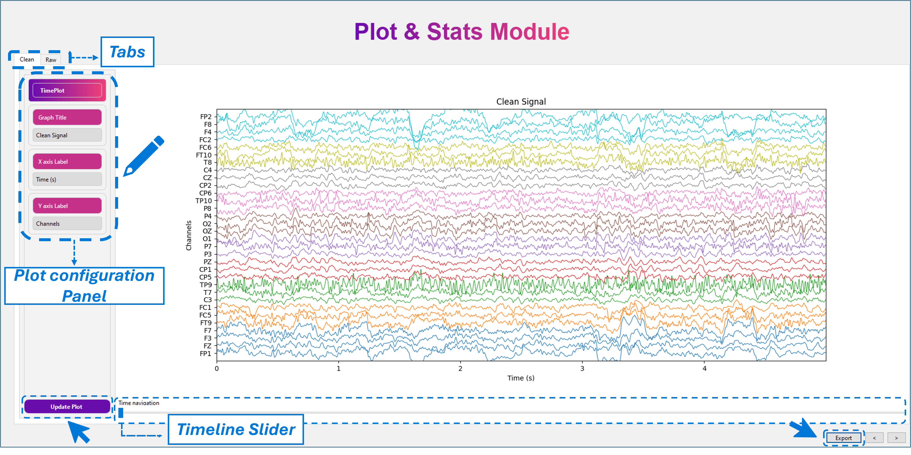

# Plot Preprocessed Signal 

The Preprocessed Signal tool enables navigation and visualization of the temporal evolution of any signal processed using MEDUSA© Analyzer.

!!! important
This module requires data generated by MEDUSA© Analyzer.
You must load a folder that contains:
- 
- `settings.json`
- the `derivatives` folder containing the `preprocessed` subfolder.

These are produced when saving results at the end of any experiment.
 
---

## 1. Loading Processed Data
The first screen asks you to select a data folder created by the Analyzer.

This folder must contain the following structure:

```pgsql
settings.json
derivatives/
```
Once the folder is selected:

- All available subjects will be displayed. 
- All available recordings are listed.

Select **one subject** and **one recording** to visualize and click `Next` to continue.

---

## 2. Temporal Navigation
After selecting a recording, the temporal representation of the preprocessed signal is shown.

{ width="1000px"}

### Navigation tools

- A timeline slider at the bottom allows you to move through the recording. 
- Hover the mouse over the plot and use the scroll wheel to zoom in/out. 
- The plot updates dynamically as you navigate.

### Switching between clean and raw data

At the top-left of the plot, two tabs are available:

- Clean — preprocessed signal 
- Raw — original, unprocessed signal

You can switch between them at any time.

### Plot Configuration Panel 
A configuration panel is located on the left side of the interface. You can modify the following:

- Plot title 
- X-axis label 
- Y-axis label

After making changes, click `Update plot` to refresh the visualization.

### Exporting the figure 
At the bottom of the window, the Export button allows you to save the currently displayed plot. 
Export options include:

- Output format
- Image size
- DPI
- Background color 
- Destination directory 
- File name

!!! tip
For best results, use image dimensions of 2800 × 2200 px.
Smaller sizes may cause slight overlap of plot elements.
Always inspect the exported figure before using it in reports or publications.

